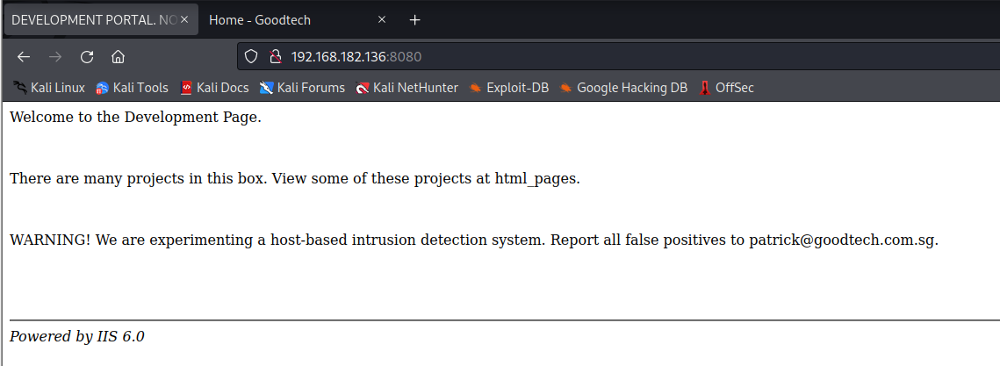
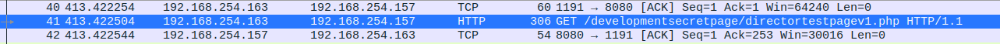
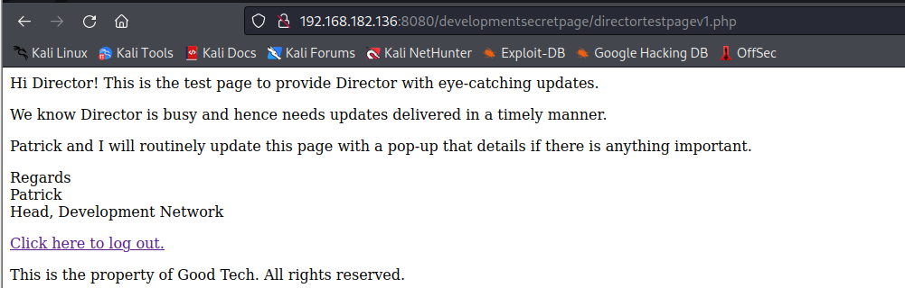

# Recon

```
nmap -sSCV 192.168.182.136

Starting Nmap 7.93 ( https://nmap.org ) at 2022-12-12 23:12 PST
Nmap scan report for 192.168.182.136
Host is up (0.00068s latency).
Not shown: 995 closed tcp ports (reset)
PORT     STATE SERVICE     VERSION
22/tcp   open  ssh         OpenSSH 7.6p1 Ubuntu 4 (Ubuntu Linux; protocol 2.0)
| ssh-hostkey: 
|   2048 79072b2c2c4e140ae7b36346c6b3ad16 (RSA)
|_  256 246b85e3ab905cecd5834954cd983195 (ED25519)
113/tcp  open  ident?
|_auth-owners: oident
139/tcp  open  netbios-ssn Samba smbd 3.X - 4.X (workgroup: WORKGROUP)
|_auth-owners: root
445/tcp  open  netbios-ssn Samba smbd 4.7.6-Ubuntu (workgroup: WORKGROUP)
|_auth-owners: root
8080/tcp open  http-proxy  IIS 6.0
|_http-server-header: IIS 6.0
| fingerprint-strings: 
|   GetRequest: 
|     HTTP/1.1 200 OK
|     Date: Tue, 13 Dec 2022 07:12:08 GMT
|     Server: IIS 6.0
|     Last-Modified: Wed, 26 Dec 2018 01:55:41 GMT
|     ETag: "230-57de32091ad69"
|     Accept-Ranges: bytes
|     Content-Length: 560
|     Vary: Accept-Encoding
|     Connection: close
|     Content-Type: text/html
|     <html>
|     <head><title>DEVELOPMENT PORTAL. NOT FOR OUTSIDERS OR HACKERS!</title>
|     </head>
|     <body>
|     <p>Welcome to the Development Page.</p>
|     <br/>
|     <p>There are many projects in this box. View some of these projects at html_pages.</p>
|     <br/>
|     <p>WARNING! We are experimenting a host-based intrusion detection system. Report all false positives to patrick@goodtech.com.sg.</p>
|     <br/>
|     <br/>
|     <br/>
|     <hr>
|     <i>Powered by IIS 6.0</i>
|     </body>
|     <!-- Searching for development secret page... where could it be? -->
|     <!-- Patrick, Head of Development-->
|     </html>
|   HTTPOptions: 
|     HTTP/1.1 200 OK
|     Date: Tue, 13 Dec 2022 07:12:08 GMT
|     Server: IIS 6.0
|     Allow: GET,POST,OPTIONS,HEAD
|     Content-Length: 0
|     Connection: close
|     Content-Type: text/html
|   RTSPRequest: 
|     HTTP/1.1 400 Bad Request
|     Date: Tue, 13 Dec 2022 07:12:08 GMT
|     Server: IIS 6.0
|     Content-Length: 294
|     Connection: close
|     Content-Type: text/html; charset=iso-8859-1
|     <!DOCTYPE HTML PUBLIC "-//IETF//DTD HTML 2.0//EN">
|     <html><head>
|     <title>400 Bad Request</title>
|     </head><body>
|     <h1>Bad Request</h1>
|     <p>Your browser sent a request that this server could not understand.<br />
|     </p>
|     <hr>
|     <address>IIS 6.0 Server at 192.168.182.136 Port 8080</address>
|_    </body></html>
|_http-open-proxy: Proxy might be redirecting requests
|_http-title: DEVELOPMENT PORTAL. NOT FOR OUTSIDERS OR HACKERS!
1 service unrecognized despite returning data. If you know the service/version, please submit the following fingerprint at https://nmap.org/cgi-bin/submit.cgi?new-service :
SF-Port8080-TCP:V=7.93%I=7%D=12/12%Time=639825C8%P=x86_64-pc-linux-gnu%r(G
SF:etRequest,330,"HTTP/1\.1\x20200\x20OK\r\nDate:\x20Tue,\x2013\x20Dec\x20
SF:2022\x2007:12:08\x20GMT\r\nServer:\x20IIS\x206\.0\r\nLast-Modified:\x20
SF:Wed,\x2026\x20Dec\x202018\x2001:55:41\x20GMT\r\nETag:\x20\"230-57de3209
SF:1ad69\"\r\nAccept-Ranges:\x20bytes\r\nContent-Length:\x20560\r\nVary:\x
SF:20Accept-Encoding\r\nConnection:\x20close\r\nContent-Type:\x20text/html
SF:\r\n\r\n<html>\r\n<head><title>DEVELOPMENT\x20PORTAL\.\x20NOT\x20FOR\x2
SF:0OUTSIDERS\x20OR\x20HACKERS!</title>\r\n</head>\r\n<body>\r\n<p>Welcome
SF:\x20to\x20the\x20Development\x20Page\.</p>\r\n<br/>\r\n<p>There\x20are\
SF:x20many\x20projects\x20in\x20this\x20box\.\x20View\x20some\x20of\x20the
SF:se\x20projects\x20at\x20html_pages\.</p>\r\n<br/>\r\n<p>WARNING!\x20We\
SF:x20are\x20experimenting\x20a\x20host-based\x20intrusion\x20detection\x2
SF:0system\.\x20Report\x20all\x20false\x20positives\x20to\x20patrick@goodt
SF:ech\.com\.sg\.</p>\r\n<br/>\r\n<br/>\r\n<br/>\r\n<hr>\r\n<i>Powered\x20
SF:by\x20IIS\x206\.0</i>\r\n</body>\r\n\r\n<!--\x20Searching\x20for\x20dev
SF:elopment\x20secret\x20page\.\.\.\x20where\x20could\x20it\x20be\?\x20-->
SF:\r\n\r\n<!--\x20Patrick,\x20Head\x20of\x20Development-->\r\n\r\n</html>
SF:\r\n")%r(HTTPOptions,A6,"HTTP/1\.1\x20200\x20OK\r\nDate:\x20Tue,\x2013\
SF:x20Dec\x202022\x2007:12:08\x20GMT\r\nServer:\x20IIS\x206\.0\r\nAllow:\x
SF:20GET,POST,OPTIONS,HEAD\r\nContent-Length:\x200\r\nConnection:\x20close
SF:\r\nContent-Type:\x20text/html\r\n\r\n")%r(RTSPRequest,1CD,"HTTP/1\.1\x
SF:20400\x20Bad\x20Request\r\nDate:\x20Tue,\x2013\x20Dec\x202022\x2007:12:
SF:08\x20GMT\r\nServer:\x20IIS\x206\.0\r\nContent-Length:\x20294\r\nConnec
SF:tion:\x20close\r\nContent-Type:\x20text/html;\x20charset=iso-8859-1\r\n
SF:\r\n<!DOCTYPE\x20HTML\x20PUBLIC\x20\"-//IETF//DTD\x20HTML\x202\.0//EN\"
SF:>\n<html><head>\n<title>400\x20Bad\x20Request</title>\n</head><body>\n<
SF:h1>Bad\x20Request</h1>\n<p>Your\x20browser\x20sent\x20a\x20request\x20t
SF:hat\x20this\x20server\x20could\x20not\x20understand\.<br\x20/>\n</p>\n<
SF:hr>\n<address>IIS\x206\.0\x20Server\x20at\x20192\.168\.182\.136\x20Port
SF:\x208080</address>\n</body></html>\n");
MAC Address: 00:0C:29:27:76:0F (VMware)
Service Info: Host: DEVELOPMENT; OS: Linux; CPE: cpe:/o:linux:linux_kernel

Host script results:
| smb2-security-mode: 
|   311: 
|_    Message signing enabled but not required
| smb-security-mode: 
|   account_used: guest
|   authentication_level: user
|   challenge_response: supported
|_  message_signing: disabled (dangerous, but default)
|_nbstat: NetBIOS name: DEVELOPMENT, NetBIOS user: <unknown>, NetBIOS MAC: 000000000000 (Xerox)
| smb2-time: 
|   date: 2022-12-13T07:13:38
|_  start_date: N/A
| smb-os-discovery: 
|   OS: Windows 6.1 (Samba 4.7.6-Ubuntu)
|   Computer name: development
|   NetBIOS computer name: DEVELOPMENT\x00
|   Domain name: \x00
|   FQDN: development
|_  System time: 2022-12-13T07:13:38+00:00

Service detection performed. Please report any incorrect results at https://nmap.org/submit/ .
Nmap done: 1 IP address (1 host up) scanned in 98.82 seconds
```

Truy cập trang chủ tại 192.168.182.136:8080:



Đến đường dẫn `html_pages`:

```
-rw-r--r-- 1 www-data www-data      285 Sep 26 17:46 about.html
-rw-r--r-- 1 www-data www-data     1049 Sep 26 17:51 config.html
-rw-r--r-- 1 www-data www-data      199 Jul 23 15:37 default.html
-rw-r--r-- 1 www-data www-data     1086 Sep 28 09:22 development.html
-rw-r--r-- 1 www-data www-data      446 Jun 14 01:37 downloads.html
-rw-r--r-- 1 www-data www-data      285 Sep 26 17:53 error.html
-rw-r--r-- 1 www-data www-data        0 Sep 28 09:23 html_pages
-rw-r--r-- 1 www-data www-data      751 Sep 28 09:22 index.html
-rw-r--r-- 1 www-data www-data      202 Sep 26 17:57 login.html
-rw-r--r-- 1 www-data www-data      682 Jul 23 15:36 register.html
-rw-r--r-- 1 www-data www-data       74 Jul 23 16:29 tryharder.html
-rw-r--r-- 1 www-data www-data      186 Sep 26 17:58 uploads.html
```

Duyệt qua các trang được liệt kê ở trên, dừng lại ở trang `downloads.html` và xem source:

```
<html>
<head><title>Useful Resources</title>
</head>
<body>
<p>Downloads:</p>
<br />
<a href="./martell.jpg">Patrick's Favourite Drink</a>
<a href="./tryharder.jpg">The Intern's Life Motto</a>
<!-- <a href="./test.pcap">Logging</a> -->
<br />
<br />
<br />
<br />
<br />
<hr>
<i>Powered by IIS 6.0</i>
</body>
</html>
```

Phát hiện một file ẩn có tên `test.pcap` tại root directory. Tải file này xuống và mở bằng wireshark:



Thấy một trang bí mật là `/developmentsecretpage/directortestpagev1.php`. Tiến hành mở trang này:

